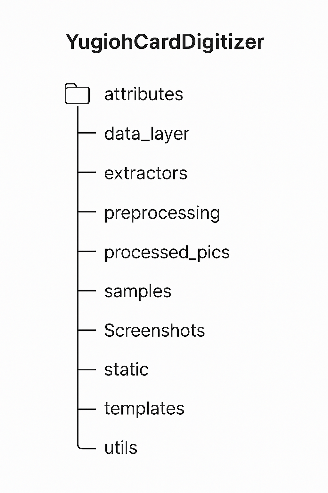
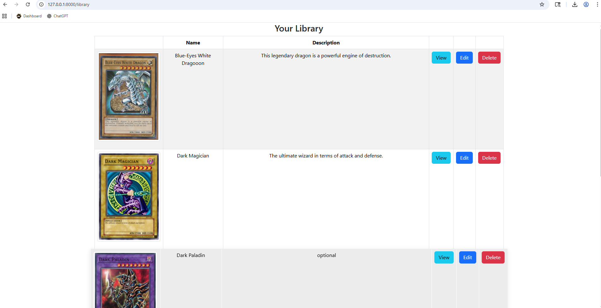
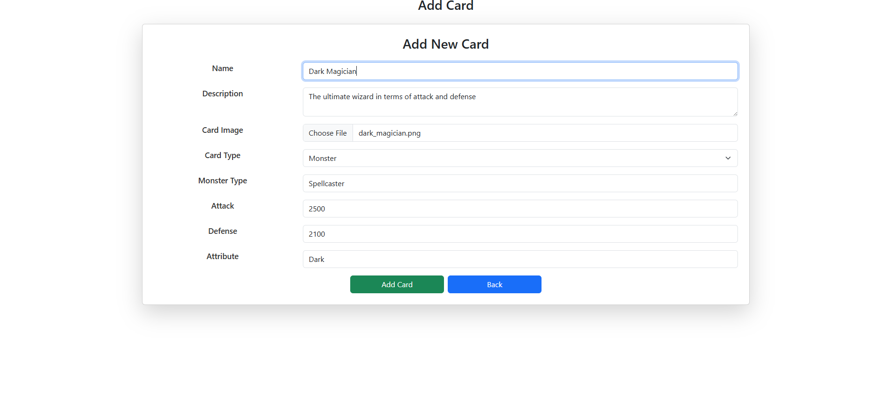
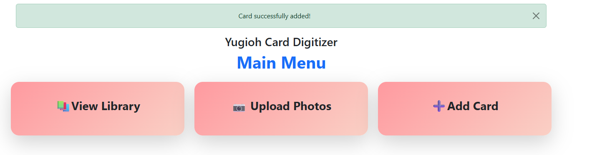

# Yugioh Card Library

<b>Table of Contents</b>
- [Summary](#summary)
- [How Does it Work](#how-does-it-work)
- [Requirements](#requirements)
- [How to Run the Application](#how-to-run-the-application)
- [Directory Structure](#directory-structure)
- [Screenshots](#screenshots)
    - [Main Menu](#main-menu)
    - [View Library Page](#library-page)
    - [Add Card Page](#add-card-page)
    - [Flash Messages](#flash-messages)
- [Maintainer](#maintainer)

# Summary

This is a library program that utilizes a python Flash interface to manage an SQL lite
database to store and manage your Yugioh cards as a digital library.

# How Does it Work?
What can this program do for you? Here's what all this program does:
- Add cards via a text entry interface, including uploading images!
- Delete or modify existing cards if you need to make changes
- iew all the cards contained in your database
- View cards one at a time for a more detailed view
- Last but not least, this app features Tesseract OCR to use card images to upload cards to you database!

# Requirements
In order to run this application, please make sure to:
- Install all needed libraries using pip commands from your IDE terminal, or right-clicking the import if your IDE supports it
- Install tesseract in its default location of: C:\Program Files\Tesseract-OCR\tesseract.exe. The Windows installer file is included in this project or go online to: https://github.com/UB-Mannheim/tesseract/wiki

And that's it!

# How to Run the Application
To run this application, simply run main.py and you're good to go! The app will be launched hosted under your local host address.

If you need to regenerate the database simply run create_database.py, and it will create a new database with seeded data

# Directory Structure
 
Curious as to what everything does? Here's the breakdown:
- Attributes: this folder contains known, accurate images to be used to compare to what OCR sees to make the best match 
- Data_Layer: this folder contains the database file, a script to recreate the database if needed, and the class file defining a Yugioh card object
- Extractors: scripts to extract the various information we need to know about a card, because every part of the card needs its own, unique processing
- Preprocessing: scripts that prepare cropped sections of a card image and prepare them for optimal success of tesseract OCR extraction
- Processed Pics: contains images of cropped and preprocessed images for debugging. You can get rid of this if you want.
- Samples: just some sample images for scanning and adding to the database
- Screenshots: used for README images
- Static: the folder Flask uses to serve static files like css, the images saved in the database, and bootstrap
- Templates: contain the html pages for the app and the base template the pages all extend
- Utils: contains various utility scripts for the app like constant variables, a debugging script, a script that installs tesseract, and the installer file itself
- Root folder: contains the main script the runs the program, the readme file, the main tesseract file that processing a full card image, and a test driver to ensure ocr is working

# Screenshots

## Main Menu

## Library Page

## Add Card Page

## Flash Messages

# Maintainer
[@bstearns07](https://github.com/bstearns07) Ben Stearns

[Back to Top](#yugioh-card-library)