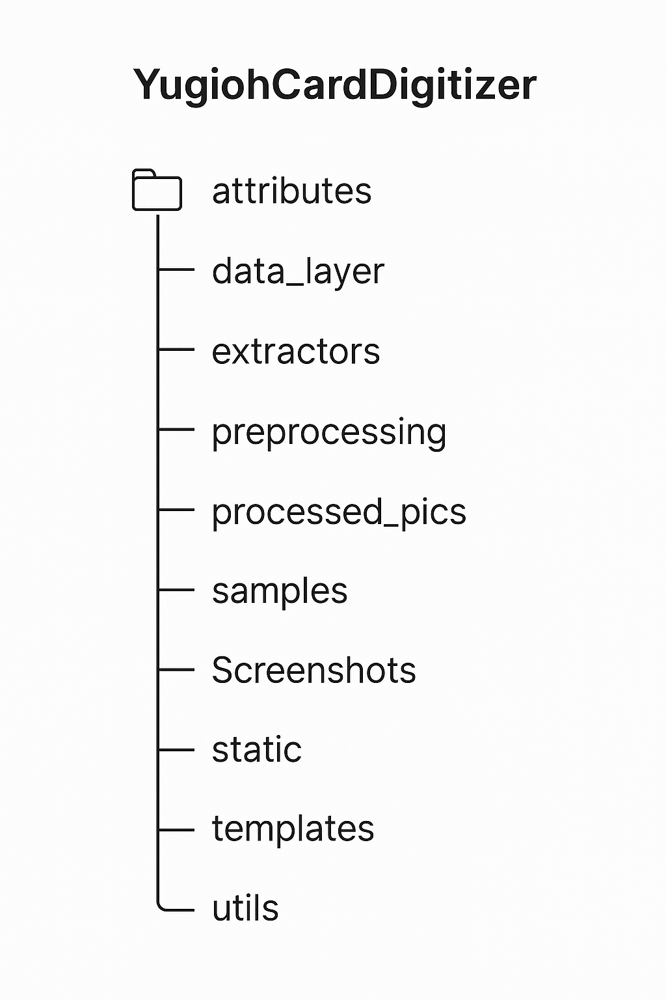
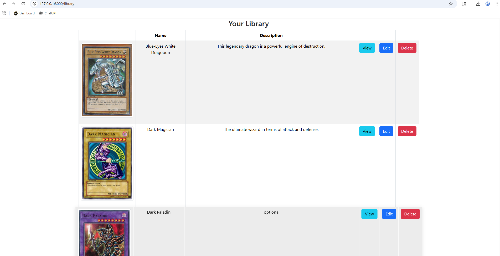
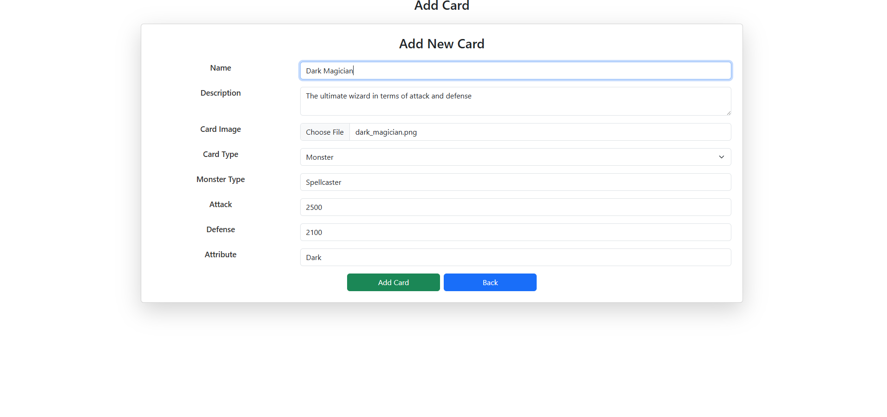
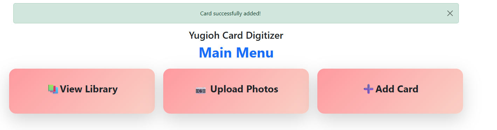

# 🃏 Yu-Gi-Oh Card Library

  
  
  
  

---

## 👤 Author
Ben Stearns - [@bstearns07](https://github.com/bstearns07)

📅 **Last Updated:** 12/13/25

---

---

## 📑 Table of Contents
- 📌 [Summary](#-summary)
- ⭐ [How It Works](#-how-it-works)
- ✨ [Features](#-features)
- 🧰 [Tech Stack](#-tech-stack)
- 🔧 [Development Tools](#-development-tools)
- 🧩 [Core Concepts](#-core-concepts)
- 📝 [New Topics Covered](#-new-topics-covered)
- 📘 [What I Learned](#-what-i-learned)
- 🖼 [Screenshots](#-screenshots)

---

## 📌 Summary

The **Yu-Gi-Oh Card Library** is a full-stack web application that allows users to create, manage, and organize a personal database of Yu-Gi-Oh cards.

Users can manually add cards or use **image scanning with OCR** to automatically extract card details. The app integrates with a cloud database and supports full CRUD operations, image uploads, and session-based caching.

What can this program do for you? Here's what all this program does:
- Add cards via a text entry interface, including uploading images!
- Delete or modify existing cards if you need to make changes
- iew all the cards contained in your database
- View cards one at a time for a more detailed view
- Last but not least, this app features Tesseract OCR to use card images to upload cards to you database!

---

## ⭐ How It Works

To run this application, simply run main.py and you're good to go! The app will be launched hosted under your local host address.

If you need to regenerate the database simply run create_database.py, and it will create a new database with seeded data

### Requirements
In order to run this application, please make sure to:
- Install all needed libraries using pip commands from your IDE terminal, or right-clicking the import if your IDE supports it
- Install tesseract in its default location of: C:\Program Files\Tesseract-OCR\tesseract.exe. The Windows installer file is included in this project or go online to: https://github.com/UB-Mannheim/tesseract/wiki

#### Directory Structure
 
Curious as to what everything does? Here's the breakdown:
- Attributes: this folder contains known, accurate images to be used to compare to what OCR sees to make the best match 
- Data_Layer: this folder contains the database file, a script to recreate the database if needed, and the class file defining a Yugioh card object
- Extractors: scripts to extract the various information we need to know about a card, because every part of the card needs its own, unique processing
- Preprocessing: scripts that prepare cropped sections of a card image and prepare them for optimal success of tesseract OCR extraction
- Processed Pics: contains images of cropped and preprocessed images for debugging. You can get rid of this if you want.
- Samples: just some sample images for scanning and adding to the database
- Screenshots: used for README images
- Static: the folder Flask uses to serve static files like css, the images saved in the database, and bootstrap
- Templates: contain the html pages for the app and the base template the pages all extend
- Utils: contains various utility scripts for the app like constant variables, a debugging script, a script that installs tesseract, and the installer file itself
- Root folder: contains the main script the runs the program, the readme file, the main tesseract file that processing a full card image, and a test driver to ensure ocr is working

And that's it!

---

## ✨ Features

- 📚 Full card library management (CRUD)
- 🖼 Image upload and storage
- 🔍 Detailed card view pages
- ✏️ Edit and update existing records
- ❌ Safe deletion with confirmation flow
- ⚡ Session caching for improved performance
- 🧠 OCR scanning using **Tesseract** to auto-fill card data
- 🔐 Input validation and error handling
- ☁️ Cloud database integration (Supabase)

---

## 🧰 Tech Stack

- 🐍 **Backend:** Python (Flask)
- 🌐 **Frontend:** HTML, CSS (Jinja Templates)
- ☁️ **Database:** Supabase (PostgreSQL)
- 🧠 **OCR:** Tesseract
- 📦 **Other Tools:**
  - `Werkzeug` – file handling & security
  - `Flask session` – caching
  - `os` – file system operations

---

## 🔧 Development Tools

- 💻 VS Code / PyCharm  
- 🌐 Web Browser (local dev server)  
- 🧪 Flask Debug Mode  
- 📁 Modular project structure  
- 🗄 Supabase dashboard  

---

## 🧩 Core Concepts

- 🌐 RESTful routing with Flask  
- 🧾 CRUD operations (Create, Read, Update, Delete)  
- 🗂 Session-based caching  
- 📂 File upload & validation  
- 🔐 Secure file handling (`secure_filename`)  
- ⚠️ Exception handling and user feedback (flash messages)  
- 🧠 OCR processing pipeline  
- ☁️ Cloud database integration  

---

## 📝 New Topics Covered

- 🧠 Optical Character Recognition (OCR) with Tesseract  
- ☁️ Cloud database usage with Supabase  
- 📦 Multi-layer architecture (routes, utils, data layer)  
- 🔄 Session caching strategies  
- 🖼 Image handling and storage  
- ⚠️ Advanced error handling and validation  
- 🔐 Secure file upload practices  

---

## 📘 What I Learned

Through this project, I gained experience with:

- Building **full-stack web applications** using Flask  
- Integrating **external APIs and services** (Supabase, OCR)  
- Designing scalable **data-driven applications**  
- Handling **file uploads and image processing**  
- Writing cleaner, modular, and maintainable code  
- Implementing **user-friendly validation and error feedback**  

---

## 🖼 Screenshots

## Main Menu

## Library Page

## Add Card Page

## Flash Messages

